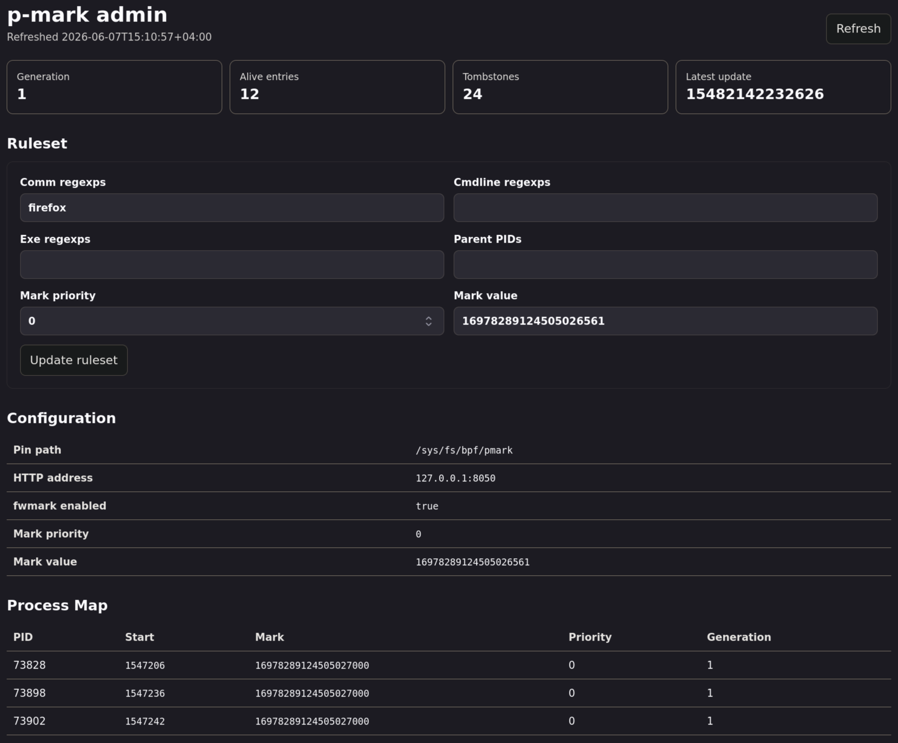

# p-mark
`p-mark` is a Go library and command for tagging Linux process lifetimes with
64-bit marks. User-space Go rules decide which processes are explicitly marked,
and eBPF programs keep those marks inherited by children of marked processes.

The root package is the process-marking engine. The `fwmark` package demonstrates
one practical consumer: copying process marks into Linux socket `SO_MARK` /
fwmark values so routing policy and firewall rules can match the process'
traffic.

> [!CAUTION]
> p-mark is an __experimental__ and __unstable__ software that work under 
> high privileges while havent being audited yet.
> __Do not use in production.__  
> Also check [issues](https://github.com/asciimoth/p-mark/issues).

## Binary Usage
The daemon loads eBPF programs and pins maps in bpffs, so it normally needs root
or equivalent capabilities.

```text
Usage of pmark:
  -fmark-value string
    	fwmark format value to derive full mark from; overwrites mark-value
  -fwmark
    	enable Linux fwmark socket marking with fwmark eBPF hooks in daemon mode
  -http-addr string
    	daemon HTTP control listen address (default "127.0.0.1:8050")
  -mark-priority int
    	signed int8 priority assigned by the default check callback; higher priority wins
  -mark-value uint
    	mark value assigned by the default check callback (default 16978289124505026561)
  -pin-path string
    	bpffs directory for pinned maps (default "/sys/fs/bpf/pmark")
  -rule-cmd string
    	comma-separated regexps matched against cmdline by the default check callback
  -rule-comm string
    	comma-separated regexps matched against comm by the default check callback (default "firefox")
  -rule-exe string
    	comma-separated regexps matched against exe and exe basename by the default check callback
  -rule-ppid string
    	comma-separated parent process ids matched by the default check callback
  -watch-interval duration
    	interval for watcher refreshes (default 1s)
  -watcher
    	watch the pinned process map instead of running the daemon
```

### Launching The Daemon
Run the default daemon, which marks processes whose `comm` matches `firefox` by default:
```sh
sudo pmark
```

Mark by other process properties:
```sh
sudo pmark \
  -pin-path /sys/fs/bpf/pmark \
  -rule-comm 'firefox,chromium' \
  -rule-cmd 'profile-name' \
  -rule-exe '/usr/bin/firefox' \
  -mark-value 16978289124505026561 \
  -mark-priority 10
```

Enable fwmark integration and derive the 64-bit pmark value from a 32-bit Linux
fwmark:
```sh
sudo ./pmark -fwmark -fmark-value 0xeb9f0001
```

With `-fwmark`, new sockets created by marked processes receive the fwmark, and
the userspace reconciler attempts to update sockets that were already open.

### Launching The Watcher
The watcher does not run the marking logic. It opens the pinned `processes` map 
and prints the currently marked process tree:
```sh
sudo pmark -watcher -pin-path /sys/fs/bpf/pmark
```

```
Process map watcher: /sys/fs/bpf/pmark/processes
Refreshed: 2026-06-07T15:08:12+04:00

Alive entries: 9
Tombstones: 152
Observed tombstones: 152
Collected tombstones: 0
Latest entry update: 1780830491 (857ms ago, boot_ns=15323572543606)

Process tree:
 73006 .firefox-wrappe mark=16978289124505026561 priority=0 gen=1
 └ 73076 forkserver mark=16978289124505026561 priority=0 gen=1
  ├ 73080 Socket Process mark=16978289124505026561 priority=0 gen=1
  ├ 73103 Privileged Cont mark=16978289124505026561 priority=0 gen=1
  ├ 73113 RDD Process mark=16978289124505026561 priority=0 gen=1
  ├ 73156 Isolated Web Co mark=16978289124505026561 priority=0 gen=1
  ├ 73165 Isolated Web Co mark=16978289124505026561 priority=0 gen=1
  ├ 73269 WebExtensions mark=16978289124505026561 priority=0 gen=1
  └ 73322 Utility Process mark=16978289124505026561 priority=0 gen=1
```

Adjust refresh rate with `-watch-interval`:
```sh
sudo ./pmark -watcher -watch-interval 500ms
```

### Admin Panel
Daemon mode starts an HTTP control server on `-http-addr`, defaulting to
`127.0.0.1:8050`. Open that address in a browser to view the admin panel. The
panel exposes current state and lets the sample regexp rules and mark settings
be updated without restarting the daemon.



### Using Marks With nftables
If you've run the daemon with `-fwmark`, you can use it later in 
iptables/nftables rules (e.g., for routing traffic of marked apps to different 
routes).

These rules will drop all packets owned by processes that have the mark attached
by the daemon from the examples above, and thus block all firefox traffic:
```bash
sudo nft delete table inet ebpf_test_fwmark 2>/dev/null
sudo nft add table inet ebpf_test_fwmark
sudo nft 'add chain inet ebpf_test_fwmark output { type filter hook output priority 0; policy accept; }'
sudo nft add rule inet ebpf_test_fwmark output meta mark 0xeb9f0001 counter drop
sudo nft add rule inet ebpf_test_fwmark output socket mark 0xeb9f0001 counter drop
```

Then you can check stats with:
```bash
sudo nft list chain inet ebpf_test_fwmark output
```

## Installation
### Nix
Build or run directly from the flake:
```sh
nix build github:asciimoth/p-mark#pmark
nix profile add github:asciimoth/p-mark#pmark
```

### Deb, and rpm-based systems
Packages are published to [my deb/rpm repository](https://repo.moth.contact):

Setup it for your sytstem via script (or manually):
```sh
curl https://repo.moth.contact/setup.sh | bash
```

Then install with your system package manager:
```sh
sudo apt install pmark
# or
sudo dnf install pmark
# or
sudo yum install pmark
```

### GitHub Releases
Release archives and package artifacts are published on the
[GitHub releases page](https://github.com/asciimoth/p-mark/releases).

### Arch
[AUR](https://aur.archlinux.org/packages/pmark-bin) is available

## Library Usage
Note: You can find more marks usage examples in [ebpf-test](https://github.com/asciimoth/ebpf-test)

### pmark
Use the pmark for custom Go logic to decide process marks in your program.
```go
package main

import (
	"log"
	"os"
	"os/signal"
	"syscall"

	pmark "github.com/asciimoth/p-mark"
)

func main() {
	daemon, err := pmark.NewDaemon("/sys/fs/bpf/pmark", pmark.Callbacks{
		Check: func(info pmark.ProcessInfo) (int8, uint64, bool) {
			if info.Comm == "firefox" {
				return 10, 0x0000004200000001, true
			}
			return 0, 0, false
		},
		ProcessUpdate: func(update pmark.ProcessUpdate) {
			log.Printf("pid=%d mark=%#x has_mark=%v",
				update.Key.Tgid, update.Value.Mark, update.Value.HasMark)
		},
		Logf: log.Printf,
	}, 0, 0)
	if err != nil {
		log.Fatal(err)
	}

	if err := daemon.Run(); err != nil {
		log.Fatal(err)
	}

	stop := make(chan os.Signal, 1)
	signal.Notify(stop, os.Interrupt, syscall.SIGTERM)
	<-stop

	if err := daemon.Stop(); err != nil {
		log.Fatal(err)
	}
}
```

Important API points:
- `CheckFunc` returns `(priority, mark, true)` to explicitly mark a process.
- Returning `ok=false` leaves the process unmarked unless a live parent mark can
  be inherited.
- `SetChecker` replaces rule logic, bumps the checker generation, and
  re-traverses `/proc`.
- `ForceProcessTraversal` re-checks current processes without bumping the
  generation.
- `GrabProcessMapState` is useful for admin panels and watchers.

### fwmark
Use `fwmark` when the mark should become the Linux socket mark used by routing
policy or firewall rules. The fwmark value is stored in the high 32 bits of the
64-bit process mark.

```go
package main

import (
	"log"
	"os"
	"os/signal"
	"syscall"

	pmark "github.com/asciimoth/p-mark"
	"github.com/asciimoth/p-mark/fwmark"
)

func main() {
	pinPath := "/sys/fs/bpf/pmark"
	mark := fwmark.ToMark(0x42)

	daemon, err := pmark.NewDaemon(pinPath, pmark.Callbacks{
		Check: func(info pmark.ProcessInfo) (int8, uint64, bool) {
			return 0, mark, info.Comm == "firefox"
		},
		Logf: log.Printf,
	}, 0, 0)
	if err != nil {
		log.Fatal(err)
	}

	manager, err := fwmark.NewManager(pinPath, log.Printf)
	if err != nil {
		log.Fatal(err)
	}
	defer manager.Close()

	fwmarkUpdate := manager.ProcessUpdateCallback()
	daemon.UpdateHooks(pmark.Callbacks{
		ProcessUpdate: fwmarkUpdate,
		Logf:          log.Printf,
	})

	if err := daemon.Run(); err != nil {
		log.Fatal(err)
	}

	stop := make(chan os.Signal, 1)
	signal.Notify(stop, os.Interrupt, syscall.SIGTERM)
	<-stop

	if err := daemon.Stop(); err != nil {
		log.Fatal(err)
	}
}
```

The `fwmark.Manager` loads cgroup eBPF programs that share the same pinned
`processes` map as the pmark daemon. Its `ProcessUpdateCallback` should be
connected to the daemon so already-open sockets are reconciled after process
marks change.

## Architecture
### General Working Principle
`p-mark` splits policy from propagation:
- Userspace owns policy. Go callbacks inspect `/proc` metadata and decide which
  process receive explicit marks.
- Kernel eBPF owns fast propagation. Tracepoint programs observe fork, exec, and
  exit transitions and maintain/emit effective mark state.
- A pinned BPF hash map named `processes` is the shared state between the root
  daemon, custom eBPF consumers, watchers, and packages such as `fwmark`.

Process identity is not just PID. The key is `(tgid, start_time)`, where
`start_time` is `/proc/<pid>/stat` field 22 in USER_HZ ticks. This avoids most
PID-reuse confusion for one boot.

### pmark pkg
`NewDaemon` loads the generated eBPF object, pins `processes` and `events` under
the configured bpffs directory, and prepares a userspace mirror. `Run` then:

1. Traverses `/proc` before attaching programs and applies `CheckFunc`.
2. Attaches tracepoint programs for `sched_process_fork`,
   `sched_process_exec`, and `sched_process_exit`.
3. Traverses `/proc` again after attaching programs. This second traversal
   narrows the race window between the first traversal and tracepoint attach.
4. Consumes the ring buffer and reconciles BPF events with userspace rules.

On fork, BPF tries to copy a live parent mark to the child before sending an
event. Userspace then reconciles that result with its mirror and calls
`CheckFunc` for the child. If the checker returns a mark, that explicit mark can
override inheritance according to normal merge rules.

On exec, BPF reports the current effective value. Userspace can re-check process
metadata because `cmdline` and `exe` may have changed.

On exit, entries become tombstones instead of immediate deletes. Tombstones keep
late events for the same process lifetime from reviving stale marks. The daemon
periodically removes old tombstones from both the userspace mirror and kernel
map.

### fwmark pkg
`fwmark` loads a cgroup `sock_create` eBPF program and attaches it to the root
cgroup. When a process creates a socket, the program computes the current
process key, looks up `processes`, and if the entry is live and marked, writes:

```text
socket fwmark = process mark >> 32
```

That covers sockets created after the mark is present. Existing sockets need
userspace help. `fwmark.Manager.ProcessUpdateCallback` returns a
`pmark.ProcessUpdate` hook that walks `/proc/<pid>/fd`, obtains each target fd
through `pidfd_getfd`, and applies `SO_MARK` with `setsockopt`.

### eBPF processes Map
The `processes` map is a pinned `BPF_MAP_TYPE_HASH` named `processes`.

Key:
```c
struct process_key {
	__u32 tgid;
	__u64 start_time;
};
```

Value:
```c
struct process_value {
	bool tombstone;
	bool inheritance;
	bool has_mark;
	__s8 priority;
	__u64 generation;
	__u64 mark;
	__u64 timestamp;
};
```

Meaning:
- `tombstone`: the process lifetime exited; treat as unmarked.
- `inheritance`: true means the mark was explicit/original from userspace;
  false means it was inherited.
- `has_mark`: gates whether `mark` and `priority` are meaningful.
- `priority`: higher priority wins when userspace merges competing live values.
- `generation`: checker generation that last reconciled the entry.
- `mark`: the 64-bit user-defined process mark.
- `timestamp`: `CLOCK_BOOTTIME` nanoseconds, also used for tombstone expiry.

Correct use:
- Treat missing entries, tombstones, and `has_mark=false` as unmarked.
- Use the full `(tgid, start_time)` key, not PID alone.
- Keep C struct layouts exactly aligned with the generated Go layout if you add
  another BPF object.
- Let the daemon own tombstone collection and rule-generation updates.
- If custom userspace writes map entries, use the same merge semantics as the
  daemon or route writes through daemon APIs such as `SetProcessMark`.

### Attaching Custom Logic To pmark
`fwmark` is the reference pattern for custom consumers.

From eBPF:
- Declare a map named `processes` with the same key/value layout and
  `LIBBPF_PIN_BY_NAME`.
- Load your eBPF collection with `ebpf.CollectionOptions{Maps:
  ebpf.MapOptions{PinPath: pinPath}}` so cilium/ebpf reuses the map pinned by
  the root daemon.
- In the hook, construct the same process key. For current tasks, use the thread
  group leader and convert `start_boottime` to USER_HZ ticks.
- Only act on values where `!tombstone && has_mark`.

From userspace:
- Start the root `pmark.Daemon` first so the shared map exists and tracepoint
  programs maintain inheritance.
- Load your custom manager with the same `pinPath`.
- Subscribe to `ProcessUpdate` to apply side effects that BPF hooks cannot apply
  retroactively.
- After installing or replacing hooks, replay or re-traverse existing state.
  `Daemon.UpdateHooks` replays current live entries to the new
  `ProcessUpdate` callback. `ForceProcessTraversal` re-checks `/proc` with the
  current checker, and `SetChecker` or `ForceBumpGeneration` re-check with a new
  generation.

That replay/re-traversal step is important for race control and for processes
that already existed before custom logic was attached. Without it, a consumer
may only see future fork/exec transitions and miss live processes that already
carry marks.

## TODO
- [ ] Figure out what to do with [time namespaces](https://github.com/asciimoth/p-mark/issues/1).
- [ ] Test on more distros arcs and configurations
- [ ] Security audit
- [ ] Flatpack app name matching in rules?

## Licenses
This repository is dual licensed under GPL or MIT; see
[LICENSE-GPL](./LICENSE-GPL)
and
[LICENSE-MIT](./LICENSE-MIT).

Note: the Go bindings embed precompiled eBPF object blobs generated by `bpf2go`
(`mark_bpf*.o` and `fwmark/fwmark_bpf*.o`). Those blobs are built from the
open-source C files in this repository (
[mark.c](./mark.c)
and
[fwmark/fwmark.c](./fwmark/fwmark.c)
), which
declare `Dual MIT/GPL` for the kernel verifier.  
You can regenerate them with:
```sh
go generate ./...
```

